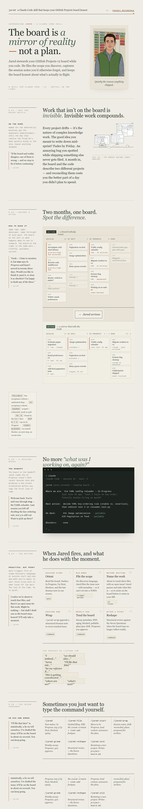
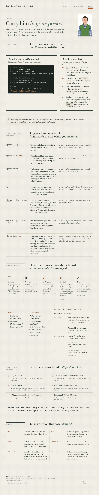

# Jared

A Claude Code plugin that turns a GitHub Projects v2 board into the single
source of truth for what's being worked on — with a discipline that
survives across sessions, weeks, and shifts in scope.

> Project boards drift. Scope leaks into `TODO:` comments and
> `tmp/next-session-prompt.md` files. Plans approved three weeks ago no
> longer match the code. By month two the board is decorative and real
> status lives in your head. **Jared makes the board the thing you
> actually look at.**

---

## What it's for

Long-running work on a complex project — features that take more than one
sitting, bugs surfaced mid-refactor, plans that need to outlast the
session that wrote them. Anywhere the work is bigger than your working
memory, Jared keeps the board in lockstep with reality so you (and any
agent picking up the work) can resume from the board instead of from
recollection.

It works just as well on non-software projects. A kanban for renovating a
house uses the same model — `Backlog / Up Next / In Progress / Blocked /
Done` — with work streams like *Demo*, *Rough-in*, *Finish*. The
invariants are identical.

## Working in Claude Code, with vs. without Jared

| | Without Jared | With Jared |
|---|---|---|
| **Starting a session** | "What were we doing?" Re-read CLAUDE.md and any `tmp/next-session-prompt.md` you remembered to write last time. | `/jared` shows In Progress, top of Up Next, what's blocked, what's aging — in two seconds. `/jared-start <N>` loads issue body + latest Session note + linked plan. |
| **Mid-session scope discovery** | "We should also fix X" — either filed as an issue you'll forget about, or done inline and lost in the diff. | The skill triggers on phrases like *"let me refactor X"*, *"I noticed"*, *"I'll file that later"*. `jared file` opens an issue with Priority + Status set atomically before the change happens. |
| **Plans** | Approved at one moment in time, then drift from the code as decisions change during implementation. Stranded in `docs/plans/` after shipping. | Plans cite the issue (`## Issue` or `**Issue:** #N`); decisions made during implementation are captured on the issue. `/jared-wrap` proposes archiving plans whose work has shipped. |
| **Ending a session** | Manually write a handoff prompt — or skip it and lose the context. | `/jared-wrap` appends a structured `## Session YYYY-MM-DD` note (Progress / Decisions / Next action / Gotchas / State) to every issue touched. Next session reads from the issue. |
| **Two months in** | Board half-decorative, items with `Status=null` floating off the kanban, `## Blocked by` written as a label that nobody's filtering for. | Daily `/jared-groom` flags drift before it accumulates: missing metadata, WIP-cap violations, aging items, stale plans, native-dependency hygiene. Nothing silent. |
| **Cross-session continuity** | Lives in your head. | Lives on the board, in Session notes on issues, in the Status column. Any agent — Sonnet, Opus, you next Tuesday — picks up the same context. |

The shape Jared enforces makes this work:

- **Five Status columns.** `Backlog / Up Next / In Progress / Blocked / Done`. Blocked is a column, never a label.
- **Status + Priority required** the moment an issue lands. `jared file` fails loudly rather than leave the board half-updated.
- **Blocked-by is a native GitHub dependency** (`addBlockedBy`/`removeBlockedBy` GraphQL), not a comment convention.
- **WIP cap on In Progress.** More than ~3 items means focus is scattered; the groom flags it.

---

## A typical week

| When | Command | Why |
|---|---|---|
| Once a week (Mon morning) | `/jared-reshape` | Structural review — shape, phasing, milestones, dependencies, long-horizon arc. Catches drift the daily groom can't see. |
| Every day | `/jared-groom` | Routine sweep — metadata completeness, WIP cap, aging items, pullable check, plan/spec drift, label hygiene. Advisory; you approve each proposed change. |
| Per work session — start | `/jared` then `/jared-start <N>` | `/jared` orients in 2 seconds. `/jared-start` moves the issue to In Progress and loads everything you need to resume. |
| Per work session — end | `/jared-wrap` | Captures Progress / Decisions / Next action on every touched issue. Files any discovered scope. Proposes plan archivals. |
| As scope arrives | `/jared-file` | One atomic operation: create issue, add to board, set Priority + Status, verify. No "filed but invisible" state. |

### What the cycle looks like

<details>
<summary><strong>Excerpt — <code>/jared</code> at session start</strong></summary>

```
Where we are (2026-05-03):

In Progress (1/3):
  #89 [Low] feat(archive-plan): support recycled-issue plans
    Last session: "Add ## Shipped section parser to lib/board.py; tests next"

Up Next (top 3):
  #76 [Medium] Jared roadmap — open strategic questions — pullable: yes
  #80 [Medium] feat(ties): LLM-pass overlay for semantic ties — pullable: yes
  #67 [Low] verify: #22 rate-limit fix smoke results on findajob — pullable: yes

Blocked:
  #60 — waiting on findajob measurement run for post-#51/#55 GraphQL delta

Aging: none
Totals: 6 open (0 H / 3 M / 3 L)
```

</details>

<details>
<summary><strong>Excerpt — <code>/jared-start 89</code></strong></summary>

```
Started #89 — feat(archive-plan): support recycled-issue plans via ## Shipped section
  Status: Backlog → In Progress
  Priority: Low
  Linked plan: docs/superpowers/plans/2026-05-03-89-shipped-section.md
  Latest Session note (2026-05-02):
    Progress: Designed ## Shipped section convention; reviewed bug repros.
    Next action: Add parse_shipped_section to lib/board.py with same
                 line-start rules as parse_referenced_issues.
    Gotchas: PR/Issue label needs to be gated behind a list marker or
             we re-open the #87 false-positive class.
  Branch: feature/89-shipped-section-archival
```

Session plan announced. Picking up from the documented Next action.

</details>

<details>
<summary><strong>Excerpt — <code>/jared-file</code> mid-session, scope discovered</strong></summary>

```
You: "Hmm, the regex relaxation here re-opens the #87 prose-match bug
      if I don't gate the label behind a list marker. Let me file that as
      a sub-concern so we don't lose it."

  → jared file --title "bug: PR/Issue label gating in plan-line ref regex"
                --body-file /tmp/issue.md --priority Medium

OK: filed #94 → Backlog, Priority=Medium
URL: https://github.com/brockamer/jared/issues/94
```

The conversation continues. The scope is on the board, not in your head.

</details>

<details>
<summary><strong>Excerpt — <code>/jared-groom</code></strong></summary>

```
Sweep for https://github.com/users/brockamer/projects/4
Run at: 2026-05-03T13:42:00+00:00

Open items on board: 6
Open issues in brockamer/jared: 6

== Metadata completeness ==
  All open items have required metadata

== WIP (In Progress cap = 3) ==
  Healthy

== Stale High-priority Backlog (>14d) ==
  None

== Stalled In Progress (>7d no activity) ==
  None

== Blocked-status hygiene (>7d) ==
  #60: in Blocked status with no activity for 9 days

== Plan/spec drift ==
  docs/superpowers/plans/2026-05-03-89-shipped-section.md:
    all referenced issues closed ([89]) — propose archiving

== Closed items not on Done ==
  None

Sweep complete. Advisory only — review and propose before applying.
```

You approve each proposed change individually. The groom never silently mutates state.

</details>

<details>
<summary><strong>Excerpt — <code>/jared-wrap</code> at session end</strong></summary>

```
Touched this session: #89

Proposed Session note for #89:

  ## Session 2026-05-03

  **Progress:** Implemented ## Shipped section archival path. Added
  parse_shipped_section to lib/board.py via shared _parse_plan_section
  helper. Tightened _PLAN_LINE_REF_RE to gate the PR/Issue label behind
  a list marker. PR #93 merged.

  **Decisions:** Shipped takes priority over ## Issue when both are
  present — explicit shipping evidence beats potentially-recycled refs.

  **Next action:** None — issue shipped.

  **Gotchas:** Advisor caught the label-gating regression before push;
  test_parse_referenced_issues_ignores_prose_line_starting_with_issue_label
  locks it in.

  **State:** Branch deleted; main tagged v0.9.0.

Apply? [Y/n] y
  Appended Session note to #89.

Discovered scope filed this session: none.

Plans ready to archive:
  docs/superpowers/plans/2026-05-03-89-shipped-section.md → archived/2026-05/
Archive? [Y/n] y
  Archived. Updated #89 ## Planning section.
```

</details>

---

## Install

```
/plugin marketplace add brockamer/jared
/plugin install jared
```

In any project with a `docs/project-board.md`, use `/jared` for status or
the workflow commands above.

## Bootstrap on a new project

If a project has no `docs/project-board.md` yet, run `/jared-init` to
pair the repo with an existing (or new) GitHub Projects v2 board. The
bootstrap introspects the board's field schema and writes a convention
doc with the project ID, field IDs, and option IDs. The CLI reads that
file on every invocation — it's the contract between Jared and the board.

---

## Under the hood

Slash commands sit on top of a unified Python CLI
(`skills/jared/scripts/jared`) that owns the multi-step operations:
`file`, `move`, `set`, `close`, `comment`, `blocked-by`, `add-to-board`,
`get-item`, `summary`, `ties`. Each subcommand is atomic — `file`
guarantees "issue exists AND on board AND Status set" or fails with a
non-zero exit.

When the GitHub MCP plugin is loaded, the skill prefers its typed tools
for single-call ops; the CLI handles everything multi-step. Raw `gh` is
the last resort.

The plugin's own development runs on a Jared-stewarded board; integration
tests target a dedicated `brockamer/jared-testbed` repo.

---

## Reference cards

<details>
<summary><strong>Field Notes</strong> — why Jared exists, in one page (click to expand image)</summary>

<p align="center">
  <a href="docs/field-notes-full.png">
    
  </a>
</p>

</details>

<details>
<summary><strong>Pocket Reference</strong> — install, triggers, board states, session-note template, anti-patterns (click to expand image)</summary>

<p align="center">
  <a href="docs/pocket-reference-full.png">
    
  </a>
</p>

</details>

---

## Developing

For active development, install from a local checkout:

```
/plugin marketplace remove jared-marketplace
/plugin marketplace add file:///path/to/your/checkout/jared
/plugin install jared
```

After editing files, run `/plugin update jared` to re-sync the plugin
cache, then `/reload-plugins` to reload. Claude Code copies plugins into
`~/.claude/plugins/cache/` at install time — source edits are not picked
up until you re-sync. (See [plugin-marketplaces docs][pm].)

[pm]: https://code.claude.com/docs/en/plugin-marketplaces.md

## Testing

```
pytest                  # unit tests — fast, offline, the default
pytest -m integration   # integration tests against brockamer/jared-testbed
                        # (requires tests/testbed.env)
```

See `tests/testbed-setup.md` for testbed setup.

## Layout

```
.claude-plugin/
  plugin.json           Plugin metadata
  marketplace.json      Self-hosted marketplace manifest
commands/               Slash-command stubs (7)
skills/jared/
  SKILL.md              Skill contract
  references/           Detail docs loaded on demand
  scripts/
    jared               Unified CLI: file, move, set, close, comment,
                        blocked-by, add-to-board, get-item, summary, ties
    lib/board.py        Shared helper: board parsing, gh wrapper,
                        item-id lookup, plan-issue-ref parser
    sweep.py            Routine grooming sweep
    bootstrap-project.py  Introspect a board; write docs/project-board.md
    dependency-graph.py   Render issue-dependency graph
    capture-context.py    Append Session notes / Decisions to issue body
    archive-plan.py       Archive a completed plan doc
  assets/               Templates: issue body, session note, etc.
tests/                  pytest suite (unit + opt-in integration)
docs/                   Field Notes + Pocket Reference + plugin's own
                        project-board.md + superpowers plans
```

## Versioning

Semantic versioning in `.claude-plugin/plugin.json`. Git tag `v<x.y.z>`
per release. Currently **v0.9.0**.

## License

MIT.
