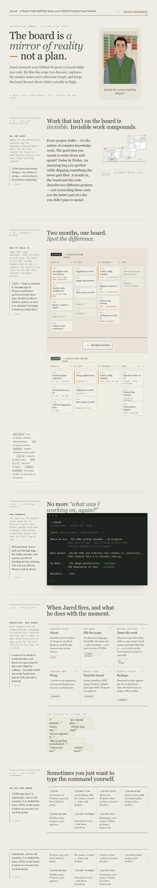
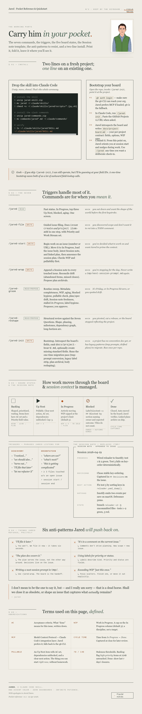

# Jared

A Claude Code plugin that turns a GitHub Projects v2 board into the single
source of truth for what's being worked on — with a discipline that
survives across sessions, weeks, and shifts in scope.

> Project boards drift. Scope leaks into `TODO:` comments and
> `tmp/next-session-prompt.md` files. Plans approved three weeks ago no
> longer match the code. By month two the board is decorative and real
> status lives in your head. **Jared makes the board the thing you
> actually look at.**

**New here?** Skip ahead to [Getting started](#getting-started) for the
install + first-command walkthrough.

---

## What it's for

Long-running work on a complex project — features that take more than one
sitting, bugs surfaced mid-refactor, plans that need to outlast the
session that wrote them. Anywhere the work is bigger than your working
memory, Jared keeps the board in lockstep with reality so you (and any
agent picking up the work) can resume from the board instead of from
recollection.

It works just as well on non-software projects. A kanban for renovating a
house uses the same model — `Backlog / Up Next / In Progress / Blocked /
Done` — with work streams like *Demo*, *Rough-in*, *Finish*. The
invariants are identical.

## Where the discipline comes from

Jared is a software-engineering translation of **Personal Kanban**, the
two-rule visual-management framework Jim Benson and Tonianne DeMaria
introduced in *Personal Kanban: Mapping Work | Navigating Life*
(Modus Cooperandi Press, 2011). The rules are deliberately small:

1. **Visualize your work.**
2. **Limit your work-in-progress.**

Everything else is consequence. The first rule turns information you'd
otherwise carry in your head into something you can scan in two seconds;
the second forces you to finish before you start.

> "Set limits to stay within capacity." — [Modus Cooperandi](https://moduscooperandi.com/)

In a software-engineering context the sticky note on the wall is a
GitHub issue, the wall is a GitHub Projects v2 board, and the column
transitions happen via API mutations Claude can execute atomically. The
discipline outlives any single chat because the state lives in GitHub,
not in your conversation history.

The two rules map directly onto what Jared enforces:

| Personal Kanban rule | How Jared enforces it |
|---|---|
| **Visualize your work** | Every issue has Status + Priority the moment it lands; `jared file` is atomic, so nothing is "filed but invisible". `Blocked` is a Status column with a `## Blocked by` body section, not a stray label. Plans cite issues, issues link back. |
| **Limit your work-in-progress** | In Progress caps at ~3 by default; `/jared-groom` flags scattered focus and stalled items; `/jared-start` is the only sanctioned way to add to In Progress, and it expects the previous session's `## Session` note to be closed out. |

## Working in Claude Code, with vs. without Jared

| | Without Jared | With Jared |
|---|---|---|
| **Starting a session** | "What were we doing?" Skim recent commits, re-read CLAUDE.md, scroll the issue list trying to remember which ones are actually live right now. | `/jared` shows In Progress, top of Up Next, what's blocked, what's aging — in two seconds. `/jared-start <N>` loads issue body + latest Session note + linked plan. |
| **Mid-session scope discovery** | "We should also fix X" — either filed as an issue you'll forget about, or done inline and lost in the diff. | The skill triggers on phrases like *"let me refactor X"*, *"I noticed"*, *"I'll file that later"*. `jared file` opens an issue with Priority + Status set atomically before the change happens. |
| **Plans** | Plans from Claude Code's plan mode (or the superpowers plugin) accumulate as markdown files. Claude reads everything in the plans directory each time, so old, shipped, or superseded plans dilute the context that's actually relevant right now. | Each plan cites its issue (`## Issue` or `**Issue:** #N`). When the issue ships, `/jared-wrap` proposes archiving the plan into `archived/YYYY-MM/`. The active set stays small enough to be load-bearing. |
| **Ending a session** | Rely on you remembering to commit cleanly, write a meaningful commit message, push, and update the right tracking artifact (issue, ticket, doc) — every time, even when the session ran long. The discipline is correct; it's also exactly the discipline that erodes first when you're tired. | `/jared-wrap` checkpoints the session onto the board: appends a structured `## Session YYYY-MM-DD` note (Progress / Decisions / Next action / Gotchas / State) to every issue touched, files any discovered scope, and proposes plan archivals. Next session reads from the issue, not your recollection. |
| **Two months in** | Board half-decorative, items with `Status=null` floating off the kanban, `## Blocked by` written as a label that nobody's filtering for. | Daily `/jared-groom` flags drift before it accumulates: missing metadata, WIP-cap violations, aging items, stale plans, native-dependency hygiene. Nothing silent. |
| **Cross-session continuity** | Lives in your head. | Lives on the board, in Session notes on issues, in the Status column. Any agent — Sonnet, Opus, you next Tuesday — picks up the same context. |

The shape Jared enforces makes this work:

- **Five Status columns.** `Backlog / Up Next / In Progress / Blocked / Done`. Blocked is a column, never a label.
- **Status + Priority required** the moment an issue lands. `jared file` fails loudly rather than leave the board half-updated.
- **Blocked-by is a native GitHub dependency** (`addBlockedBy`/`removeBlockedBy` GraphQL), not a comment convention.
- **WIP cap on In Progress.** More than ~3 items means focus is scattered; the groom flags it.

---

## A typical week

| When | Command | Why |
|---|---|---|
| Once a week (Mon morning) | `/jared-reshape` | Structural review — shape, phasing, milestones, dependencies, long-horizon arc. Catches drift the daily groom can't see. |
| Every day | `/jared-groom` | Routine sweep — metadata completeness, WIP cap, aging items, pullable check, plan/spec drift, label hygiene. Advisory; you approve each proposed change. |
| Every day or so | `/jared-stage` | Propose promotions from Backlog → Up Next and revisit anything sitting in Blocked. Advisory; you approve each move before it applies. |
| Per work session — start | `/jared` then `/jared-start <N>` | `/jared` orients in 2 seconds. `/jared-start` moves the issue to In Progress and loads everything you need to resume. |
| Per work session — end | `/jared-wrap` | Captures Progress / Decisions / Next action on every touched issue. Files any discovered scope. Proposes plan archivals. |
| As scope arrives | `/jared-file` | One atomic operation: create issue, add to board, set Priority + Status, verify. No "filed but invisible" state. |

### What the cycle looks like

<details>
<summary><strong>Excerpt — <code>/jared</code> at session start</strong></summary>

```
Where we are (2026-05-03):

In Progress (1/3):
  #89 [Low] feat(archive-plan): support recycled-issue plans
    Last session: "Add ## Shipped section parser to lib/board.py; tests next"

Up Next (top 3):
  #76 [Medium] Jared roadmap — open strategic questions — pullable: yes
  #80 [Medium] feat(ties): LLM-pass overlay for semantic ties — pullable: yes
  #67 [Low] verify: #22 rate-limit fix smoke results on findajob — pullable: yes

Blocked:
  #60 — waiting on findajob measurement run for post-#51/#55 GraphQL delta

Aging: none
Totals: 6 open (0 H / 3 M / 3 L)
```

</details>

<details>
<summary><strong>Excerpt — <code>/jared-start 89</code></strong></summary>

```
Started #89 — feat(archive-plan): support recycled-issue plans via ## Shipped section
  Status: Backlog → In Progress
  Priority: Low
  Linked plan: docs/superpowers/plans/2026-05-03-89-shipped-section.md
  Latest Session note (2026-05-02):
    Progress: Designed ## Shipped section convention; reviewed bug repros.
    Next action: Add parse_shipped_section to lib/board.py with same
                 line-start rules as parse_referenced_issues.
    Gotchas: PR/Issue label needs to be gated behind a list marker or
             we re-open the #87 false-positive class.
  Branch: feature/89-shipped-section-archival
```

Session plan announced. Picking up from the documented Next action.

</details>

<details>
<summary><strong>Excerpt — <code>/jared-file</code> mid-session, scope discovered</strong></summary>

```
You: "Hmm, the regex relaxation here re-opens the #87 prose-match bug
      if I don't gate the label behind a list marker. Let me file that as
      a sub-concern so we don't lose it."

  → jared file --title "bug: PR/Issue label gating in plan-line ref regex"
                --body-file /tmp/issue.md --priority Medium

OK: filed #94 → Backlog, Priority=Medium
URL: https://github.com/brockamer/jared/issues/94
```

The conversation continues. The scope is on the board, not in your head.

</details>

<details>
<summary><strong>Excerpt — <code>/jared-groom</code></strong></summary>

```
Sweep for https://github.com/users/brockamer/projects/4
Run at: 2026-05-03T13:42:00+00:00

Open items on board: 6
Open issues in brockamer/jared: 6

== Metadata completeness ==
  All open items have required metadata

== WIP (In Progress cap = 3) ==
  Healthy

== Stale High-priority Backlog (>14d) ==
  None

== Stalled In Progress (>7d no activity) ==
  None

== Blocked-status hygiene (>7d) ==
  #60: in Blocked status with no activity for 9 days

== Plan/spec drift ==
  docs/superpowers/plans/2026-05-03-89-shipped-section.md:
    all referenced issues closed ([89]) — propose archiving

== Closed items not on Done ==
  None

Sweep complete. Advisory only — review and propose before applying.
```

You approve each proposed change individually. The groom never silently mutates state.

</details>

<details>
<summary><strong>Excerpt — <code>/jared-wrap</code> at session end</strong></summary>

```
Touched this session: #89

Proposed Session note for #89:

  ## Session 2026-05-03

  **Progress:** Implemented ## Shipped section archival path. Added
  parse_shipped_section to lib/board.py via shared _parse_plan_section
  helper. Tightened _PLAN_LINE_REF_RE to gate the PR/Issue label behind
  a list marker. PR #93 merged.

  **Decisions:** Shipped takes priority over ## Issue when both are
  present — explicit shipping evidence beats potentially-recycled refs.

  **Next action:** None — issue shipped.

  **Gotchas:** Advisor caught the label-gating regression before push;
  test_parse_referenced_issues_ignores_prose_line_starting_with_issue_label
  locks it in.

  **State:** Branch deleted; main tagged v0.9.0.

Apply? [Y/n] y
  Appended Session note to #89.

Discovered scope filed this session: none.

Plans ready to archive:
  docs/superpowers/plans/2026-05-03-89-shipped-section.md → archived/2026-05/
Archive? [Y/n] y
  Archived. Updated #89 ## Planning section.
```

</details>

---

## Getting started

### Prerequisites

- **Claude Code.** Jared's commands are typed into the Claude Code chat,
  not into your shell.
  ([Install Claude Code](https://code.claude.com/docs/en/quickstart))
- **`gh` CLI, authenticated.** Every Jared operation calls GitHub on
  your behalf. Run `gh auth login` if you haven't; confirm with
  `gh auth status`.
- **GitHub token with `project` scope.** The default scopes from
  `gh auth login` cover `repo` but not `project`. Add it with:

    ```
    gh auth refresh -s project
    ```

    Without `project` scope, board mutations fail silently or with
    confusing 404s.
- **A GitHub Projects v2 board.** Either an existing one you want to
  steward, or a fresh empty project at
  `https://github.com/users/<you>/projects`. Jared works with any
  board — it introspects the field schema during bootstrap.

### Install jared

In Claude Code:

```
/plugin marketplace add brockamer/jared
/plugin install jared
```

After install, the 8 slash commands (`/jared`, `/jared-file`,
`/jared-start`, `/jared-stage`, `/jared-groom`, `/jared-reshape`,
`/jared-wrap`, `/jared-init`) become available.

### Bootstrap your project

Open a project where you want Jared to steward the board. If it has
no `docs/project-board.md` yet, run:

```
/jared-init
```

The bootstrap asks for your project's URL (for example
`https://github.com/users/you/projects/4`), introspects the board's
Status and Priority field schema, and writes the convention doc to
`docs/project-board.md`. **Commit and push it** — the CLI re-reads it
on every invocation, so it has to live in the repo.

<details>
<summary><strong>Excerpt — what <code>/jared-init</code> generates</strong></summary>

```
# Project Board — How It Works

- Project URL: https://github.com/users/you/projects/4
- Project number: 4
- Project ID: PVT_kwHO...
- Owner: you
- Repo: you/yourproject

### Status
- Field ID: PVTSSF_lAHO...
- Backlog: 4e0a1177
- Up Next: b44a3a0e
- In Progress: 47fc9ee4
- Blocked: 4d8fe8ca
- Done: 98236657

### Priority
- Field ID: PVTSSF_lAHO...
- High: adef53b9
- Medium: d5a00122
- Low: 7d424cac

(... narrative conventions follow — human-editable, machine-parsed ...)
```

Re-run `/jared-init` whenever you rename board fields or add option
values; the field IDs must stay in sync.

</details>

### First command

```
/jared
```

You should see your project URL, an `In Progress (0)` line, and the top
of Up Next / Blocked. That's the board posture — the same shape as the
[`/jared` excerpt above](#a-typical-week).

> If `/jared` errors with "no docs/project-board.md found," the
> bootstrap step was skipped or the file lives elsewhere. The CLI
> autodiscovers across `docs/project-board.md`,
> `docs/maintainers/project-board.md`, `PROJECT_BOARD.md`, and
> `.github/project-board.md` — pass `--board <path>` if yours is
> somewhere else.

---

## Under the hood

Slash commands sit on top of a unified Python CLI
(`skills/jared/scripts/jared`) that owns the multi-step operations:
`file`, `move`, `set`, `close`, `comment`, `blocked-by`, `add-to-board`,
`get-item`, `summary`, `ties`, `next-session-prompt`. Each subcommand
is atomic — `file` guarantees "issue exists AND on board AND Status
set" or fails with a non-zero exit.

When the GitHub MCP plugin is loaded, the skill prefers its typed tools
for single-call ops; the CLI handles everything multi-step. Raw `gh` is
the last resort.

The plugin's own development runs on a Jared-stewarded board; integration
tests target a dedicated `brockamer/jared-testbed` repo.

---

## Reference cards

<details>
<summary><strong>Field Notes</strong> — why Jared exists, in one page (click to expand image)</summary>

<p align="center">
  <a href="docs/field-notes-full.png">
    
  </a>
</p>

</details>

<details>
<summary><strong>Pocket Reference</strong> — install, triggers, board states, session-note template, anti-patterns (click to expand image)</summary>

<p align="center">
  <a href="docs/pocket-reference-full.png">
    
  </a>
</p>

</details>

---

## Developing

For active development, install from a local checkout. Note: the
remove step takes the marketplace's `name` from its `marketplace.json`
(for jared, that's `jared-marketplace`), not the `brockamer/jared`
repo path you used to add it:

```
/plugin marketplace remove jared-marketplace
/plugin marketplace add file:///path/to/your/checkout/jared
/plugin install jared
```

After editing files, run `/plugin update jared` to re-sync the plugin
cache, then `/reload-plugins` to reload. Claude Code copies plugins into
`~/.claude/plugins/cache/` at install time — source edits are not picked
up until you re-sync. (See [plugin-marketplaces docs][pm].)

For the full contributor setup — Python venv with `uv`, `ruff`,
`mypy`, the dual-import-path gotcha around the `Board` helper, and the
testbed configuration — see [`CLAUDE.md`](CLAUDE.md).

[pm]: https://code.claude.com/docs/en/plugin-marketplaces.md

## Testing

```
pytest                  # unit tests — fast, offline, the default
pytest -m integration   # integration tests against brockamer/jared-testbed
                        # (requires tests/testbed.env)
```

The pytest commands assume the dev venv is active — see
[`CLAUDE.md`](CLAUDE.md) for `uv venv` setup. Integration tests are
opt-in; `tests/testbed-setup.md` covers the testbed config.

## Layout

```
.claude-plugin/
  plugin.json           Plugin metadata
  marketplace.json      Self-hosted marketplace manifest
commands/               Slash-command stubs (8): /jared, /jared-file,
                        /jared-start, /jared-stage, /jared-groom,
                        /jared-reshape, /jared-wrap, /jared-init
skills/jared/
  SKILL.md              Skill contract
  references/           Detail docs loaded on demand
  scripts/
    jared               Unified CLI: file, move, set, close, comment,
                        blocked-by, add-to-board, get-item, summary,
                        ties, next-session-prompt
    lib/board.py        Shared helper: board parsing, gh wrapper,
                        item-id lookup, plan-issue-ref parser
    sweep.py            Routine grooming sweep
    bootstrap-project.py  Introspect a board; write docs/project-board.md
    dependency-graph.py   Render issue-dependency graph
    capture-context.py    Append Session notes / Decisions to issue body
    archive-plan.py       Archive a completed plan doc
  assets/               Templates: issue body, session note, etc.
tests/                  pytest suite (unit + opt-in integration)
docs/                   Field Notes + Pocket Reference + plugin's own
                        project-board.md + superpowers plans
```

## Versioning

Semantic versioning in `.claude-plugin/plugin.json` (the source of
truth). Git tag `v<x.y.z>` per release.

## License

MIT.
